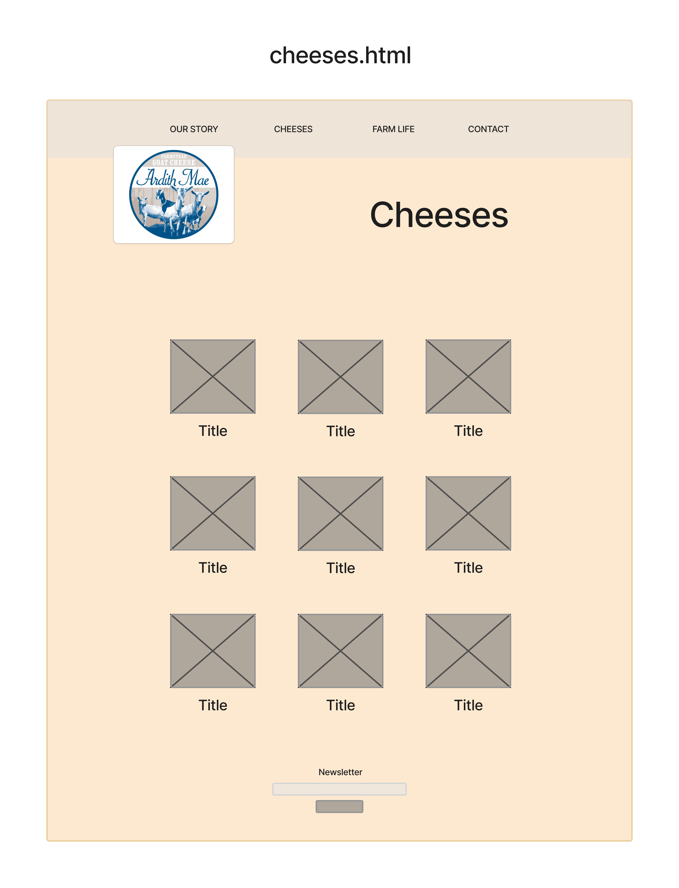

# capstone-project

Ardith Mae Farms 

## About

My project is to create a new site for a goat farm that sells goat cheese

## Built with

* HTML
* CSS
* Bootstrap
* Javasript

## Roadmap

- [x] Make wireframes
- [x] Create HTML elements.
- [x] Add bootstrap grid layout.
- [x] Modify bootstrap with CSS.
- [x] Add Javascript functions.
- [x] Keep adjusting CSS forever.

## Wireframe

## Contact

Chris Alinaghian @ chrisdafur@gmail.com

## Acknowledgements

* stackoverflow.com
* w3schools.com
* getbootstrap.com
* docs.emmet.io
* freecodecamp.org
* Jennifer Tarleton
* ardithmaefarms.com